# 第 9 章  无线网络和移动网络

> 学习内容来源网络，若有侵权联系：shaoyayu0419@qq.com删除
>
> 计算机网络谢希仁第七版网课

## 9.1  无线局域网 WLAN

### 9.1.1  无线局域网的组成

无线局域网 WLAN (Wireless Local Area Network) 可分为两大类：

1. 有固定基础设施的 WLAN
2. 无固定基础设施的 WLAN

所谓“固定基础设施”是指预先建立起来的、能够覆盖一定地理范围的一批固定基站。

#### 1. IEEE 802.11

IEEE 802.11 是一个有固定基础设施的无线局域网的国际标准。

IEEE 802.11 是个相当复杂的标准。但简单地说，802.11 就是无线以太网的标准：

1. 它使用星形拓扑，其中心叫做接入点 AP (Access Point)
2. 在MAC层使用 CSMA/CA 协议

凡使用 802.11 系列协议的局域网又称为 Wi-Fi (Wireless-Fidelity，意思是“无线保真度”。

IEEE 802.11 的基本服务集 BSS 和扩展服务集 ESS

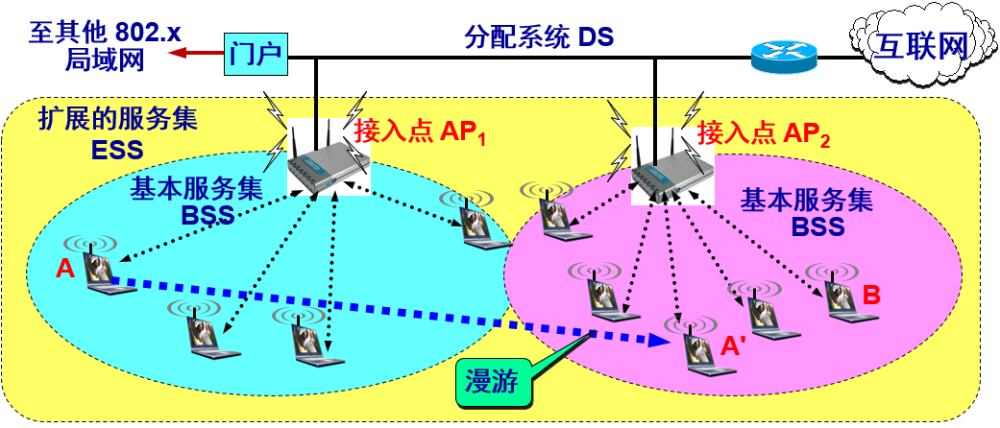

一个基本服务集 BSS 包括一个基站和若干个移动站，所有的站在本 BSS 以内都可以直接通信，但在和本 BSS 以外的站通信时 ，都要通过本 BSS 的基站。 

基本服务集内的基站叫做接入点 AP (Access Point)其作用和网桥相似。

当网络管理员安装 AP 时，必须为该 AP 分配一个不超过 32 字节的服务集标识符 SSID 和一个信道。 

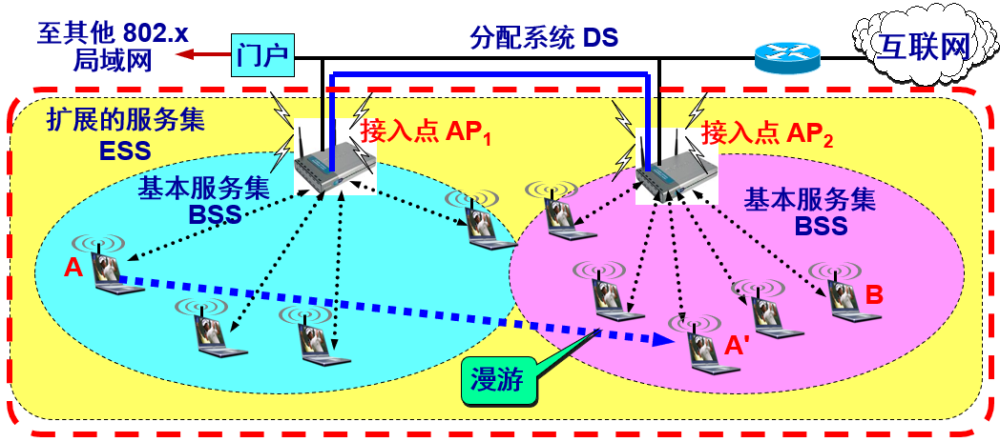

一个基本服务集可以是孤立的，也可通过接入点 AP连接到一个主干分配系统 DS (Distribution System)，然后再接入到另一个基本服务集，构成扩展的服务集 ESS (Extended Service Set)。

ESS 还可通过叫做门户 (portal) 为无线用户提供到非 802.11 无线局域网（例如，到有线连接的互联网）的接入。门户的作用就相当于一个网桥。 

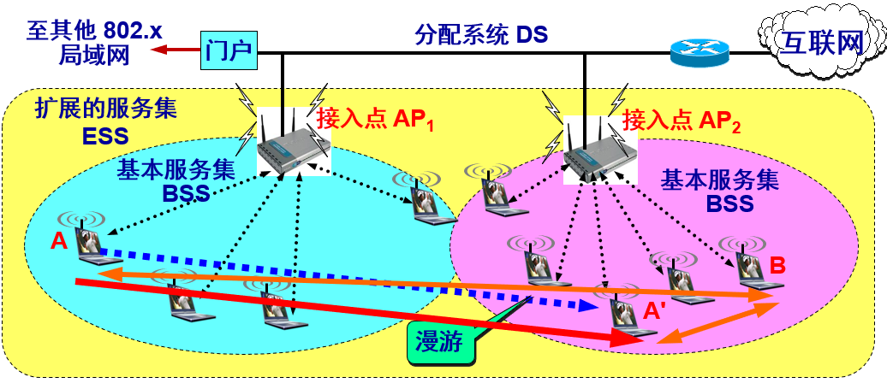

移动站 A 从某一个基本服务集漫游到另一个基本服务集（到 A 的位置），仍可保持与另一个移动站 B 进行通信。 

**建立关联(association)**

一个移动站若要加入到一个基本服务集 BSS，就必须先选择一个接入点 AP，并与此接入点建立关联 (association) 。
建立关联就表示这个移动站加入了选定的 AP 所属的子网，并和这个 AP 之间创建了一个虚拟线路。
只有关联的 AP 才向这个移动站发送数据帧，而这个移动站也只有通过关联的 AP 才能向其他站点发送数据帧。

**移动站与 AP 建立关联的方法**

被动扫描

1. 移动站等待接收接入站周期性发出的信标帧(beacon frame)。
2. 信标帧中包含有若干系统参数（如服务集标识符 SSID 以及支持的速率等）。

主动扫描

1. 移动站主动发出探测请求帧(probe request frame)，然后等待从 AP 发回的探测响应帧(probe response frame)。

**热点 (hot spot)**

现在许多地方，如办公室、机场、快餐店、旅馆、购物中心等都能够向公众提供有偿或无偿接入 Wi-Fi 的服务。这样的地点就叫做热点。

由许多热点和 AP 连接起来的区域叫做热区 (hot zone)。热点也就是公众无线入网点。

现在也出现了无线互联网服务提供者 WISP (Wireless Internet Service Provider) 这一名词。用户可以通过无线信道接入到 WISP，然后再经过无线信道接入到互联网。

#### 2. 移动自组网络

移动自组网络又称为自组网络 (ad hoc network) 。

自组网络是没有固定基础设施（即没有 AP）的无线局域网。

这种网络是由一些处于平等状态的移动站之间相互通信组成的临时网络。

自组网络的服务范围通常是受限的，而且一般也不和外界的其他网络相连接。

移动自组网络也就是移动分组无线网络。

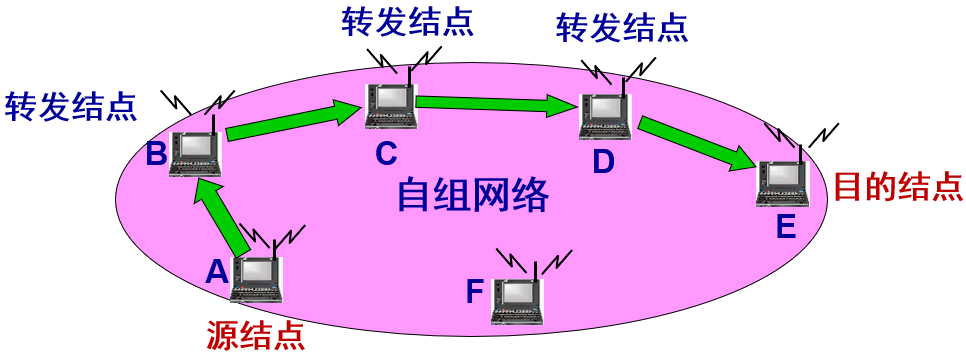

三个主要问题：路由选择协议，多播，安全。

**移动自组网络的应用前景** 

在军事领域中，携带了移动站的战士可利用临时建立的移动自组网络进行通信。

这种组网方式也能够应用到作战的地面车辆群和坦克群，以及海上的舰艇群、空中的机群。 

当出现自然灾害时，在抢险救灾时利用移动自组网络进行及时的通信往往很有效的，  

**无线传感器网络 WSN**

无线传感器网络 WSN (Wireless Sensor Network) 是由大量传感器结点通过无线通信技术构成的自组网络。

无线传感器网络的应用是进行各种数据的采集、处理和传输，一般并不需要很高的带宽，但是在大部分时间必须保持低功耗，以节省电池的消耗。

由于无线传感结点的存储容量受限，因此对协议栈的大小有严格的限制。

无线传感器网络还对网络安全性、结点自动配置、网络动态重组等方面有一定的要求。 

**传感器结点的形状和组成**

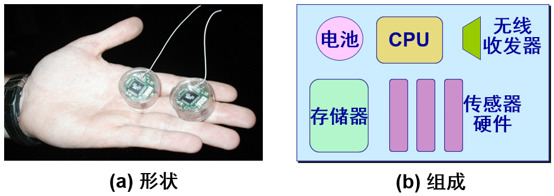

**无线传感器网络主要的应用领域** 

无线传感器网络主要的应用领域就是组成各种的物联网 IoT (Internet of Things) ，例如：

- 环境监测与保护（如洪水预报、动物栖息的监控）；
- 战争中对敌情的侦查和对兵力、装备、物资等的监控；
- 医疗中对病房的监测和对患者的护理；
- 在危险的工业环境（如矿井、核电站等）中的安全监测；
- 城市交通管理、建筑内的温度/照明/安全控制等。 

**移动自组网络不同于移动 IP**

移动 IP 技术使漫游的主机可以用多种方式连接到互联网。

移动 IP 的核心网络功能仍然是基于在固定互联网中一直在使用的各种路由选择协议。

移动自组网络是将移动性扩展到无线领域中的自治系统，它具有自己特定的路由选择协议，并且可以不和互联网相连。  

**几种不同的接入**

固定接入 (fixed access)——在作为网络用户期间，用户设置的地理位置保持不变。

移动接入 (mobility access)——用户设置能够以车辆速度移动时进行网络通信。当发生切换时，通信仍然是连续的。

便携接入 (portable access)——在受限的网络覆盖面积中，用户设备能够在以步行速度移动时进行网络通信，提供有限的切换能力。

游牧接入 (nomadic access)——用户设备的地理位置至少在进行网络通信时保持不变。如用户设备移动了位置，则再次进行通信时可能还要寻找最佳的基站。

### 9.1.2  802.11 局域网的物理层

802.11 标准中物理层相当复杂。根据物理层的不同（如工作频段、数据率、调制方法等），对应的标准也不同。

最早流行的无线局域网是 802.11b，802.11a 和802.11g。2009年颁布了标准 802.11n

802.11 的物理层有以下几种实现方法：

- 直接序列扩频 DSSS
- 正交频分复用 OFDM 
- 跳频扩频 FHSS （已很少用）
- 红外线 IR （已很少用） 

**几种常用的 802.11 无线局域网** 

| 标准              | 频段         | 数据速率       | 物理层     | 优缺点                                                       |
| ----------------- | ------------ | -------------- | ---------- | ------------------------------------------------------------ |
| 802.11b  (1999年) | 2.4 GHz      | 最高11  Mbit/s | 扩频       | 最高数据率较低，价格最低，信号传播距离最远，且不易受阻碍。   |
| 802.11a  (1999年) | 5 GHz        | 最高54  Mbit/s | OFDM       | 最高数据率较高，支持更多用户同时上网，价格最高，信号传播距离较短，且易受阻碍。 |
| 802.11g  (2003年) | 2.4 GHz      | 最高54  Mbit/s | OFDM       | 最高数据率较高，支持更多用户同时上网，信号传播距离最远，且不易受阻碍，价格比802.11b贵。 |
| 802.11n  (2009年) | 2.4  / 5 GHz | 最高600 Mbit/s | MIMO  OFDM | 使用多个发射和接收天线达到更高的数据传输率。当使用双倍带宽(40  MHz)时速率可达600  Mbit/s。 |

### 9.1.3  802.11 局域网的 MAC 层协议

#### 1、CSMA/CA 协议 

无线局域网不能简单地搬用 CSMA/CD 协议。这里主要有两个原因：

- “碰撞检测”要求一个站点在发送本站数据的同时，还必须不间断地检测信道，但接收到的信号强度往往会远远小于
  发送信号的强度，在无线局域网的设备中要实现这种功能就花费过大。
- 即使能够实现碰撞检测的功能，并且在发送数据时检测到信道是空闲的时候，在接收端仍然有可能发生碰撞。  

这种未能检测出媒体上已存在的信号的问题叫做隐蔽站问题(hidden station problem) 

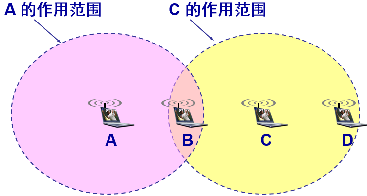

当 A 和 C 检测不到无线信号时，都以为 B 是空闲的，因而都向 B 发送数据，结果发生碰撞。

---

其实 B 向 A 发送数据并不影响 C 向 D 发送数据这就是暴露站问题(exposed station problem) 

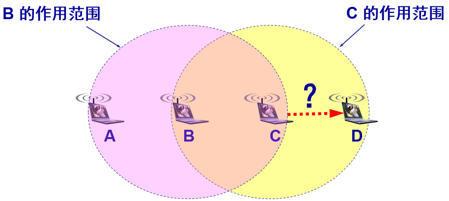

B 向 A 发送数据，而 C 又想和 D 通信。C 检测到媒体上有信号，于是就不敢向 D 发送数据。 

**CSMA/CA 协议**

无线局域网不能使用 CSMA/CD，而只能使用改进的 CSMA 协议。

改进的办法是把 CSMA 增加一个碰撞避免CA (Collision Avoidance)功能。

802.11 就使用 CSMA/CA 协议。而在使用 CSMA/CA 的同时，还增加使用停止等待协议。

下面先介绍 802.11 的 MAC 层。     

**802.11 的 MAC 层** 

MAC 层通过协调功能来确定在基本服务集 BSS 中的移动站在什么时间能发送数据或接收数据。 

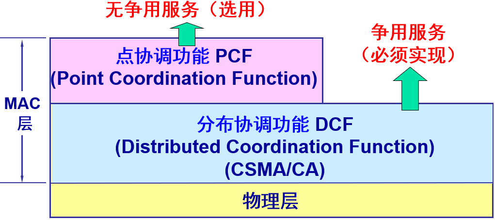

PCF 子层使用集中控制的接入算法把发送数据权轮流交给各个站从而避免了碰撞的产生。自组网络就没有PCF子层。 

DCF 子层在每一个结点使用 CSMA 机制的分布式接入算法，让各个站通过争用信道来获取发送权。因此 DCF 向上提供争用服务。

**帧间间隔 IFS** 

所有的站在完成发送后，必须再等待一段很短的时间（继续监听）才能发送下一帧。这段时间的通称是帧间间隔 IFS (InterFrame Space)。

帧间间隔长度取决于该站欲发送的帧的类型。高优先级帧需要等待的时间较短，因此可优先获得发送权。

若低优先级帧还没来得及发送而其他站的高优先级帧已发送到媒体，则媒体变为忙态，因而低优先级帧就只能再推迟发送了。这样就减少了发生碰撞的机会。   

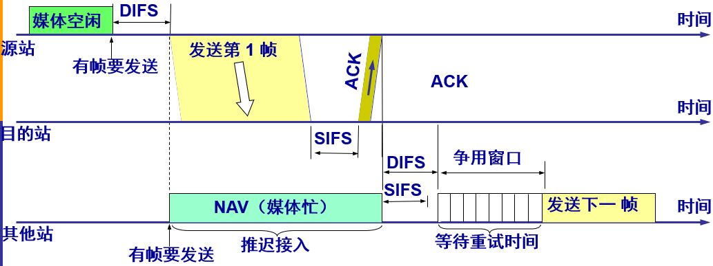

SIFS，即短 (Short) 帧间间隔，长度为 28 s，是最短的帧间间隔，用来分隔开属于一次对话的各帧。一个站应当能够在这段时间内从发送方式切换到接收方式。

使用 SIFS 的帧类型有：ACK 帧、CTS 帧、由过长的 MAC 帧分片后的数据帧，以及所有回答 AP 探询的帧和在 PCF 方式中接入点 AP 发送出的任何帧。

DIFS，即分布协调功能帧间间隔，它比 SIFS 的帧间间隔要长得多，长度为 128 s。在 DCF 方式中，DIFS 用来发送数据帧和管理帧。

**CSMA/CA 协议的原理** 

欲发送数据的站先检测信道。在 802.11 标准中规定了在物理层的空中接口进行物理层的载波监听。

通过收到的相对信号强度是否超过一定的门限数值就可判定是否有其他的移动站在信道上发送数据。

当源站发送它的第一个 MAC 帧时，若检测到信道空闲，则在等待一段时间 DIFS 后就可发送。

**为什么信道空闲还要再等待** 

这是考虑到可能有其他的站有高优先级的帧要发送。

如有，就要让高优先级帧先发送。 

**假定没有高优先级帧要发送** 

源站发送了自己的数据帧。

目的站若正确收到此帧，则经过时间间隔 SIFS 后，向源站发送确认帧 ACK。

若源站在规定时间内没有收到确认帧 ACK（由重传计时器控制这段时间），就必须重传此帧，直到收到确认为止，或者经过若干次的重传失败后放弃发送。 

**虚拟载波监听** 

虚拟载波监听 (Virtual Carrier Sense) 的机制是让源站将它要占用信道的时间（包括目的站发回确认帧所需的时间）通知给所有其他站，以便使其他所有站在这一段时间都停止发送数据。

这样就大大减少了碰撞的机会。 

“虚拟载波监听”是表示其他站并没有监听信道，而是由于其他站收到了“源站的通知”才不发送数据。

**虚拟载波监听的效果** 

这种效果好像是其他站都监听了信道。

所谓“源站的通知”就是源站在其 MAC 帧首部中的第二个字段“持续时间”中填入了在本帧结束后还要占用信道多少时间（以微秒为单位），包括目的站发送确认帧所需的时间。 

**网络分配向量** 

当一个站检测到正在信道中传送的 MAC 帧首部的“持续时间”字段时，就调整自己的网络分配向量 NAV (Network Allocation Vector)。

NAV 指出了必须经过多少时间才能完成数据帧的这次传输，才能使信道转入到空闲状态。 

**争用窗口** 

信道从忙态变为空闲时，任何一个站要发送数据帧时，不仅都必须等待一个 DIFS 的间隔，而且还要进入争用窗口，并计算随机退避时间以便再次重新试图接入到信道。

在信道从忙态转为空闲时，为了避免几个站同时发送数据（一旦发送就要把一帧发送完，不能中途停止），各站就要执行退避算法。这样做就减少了发生碰撞的概率。

802.11 使用二进制指数退避算法。   

**802.11 的退避机制**

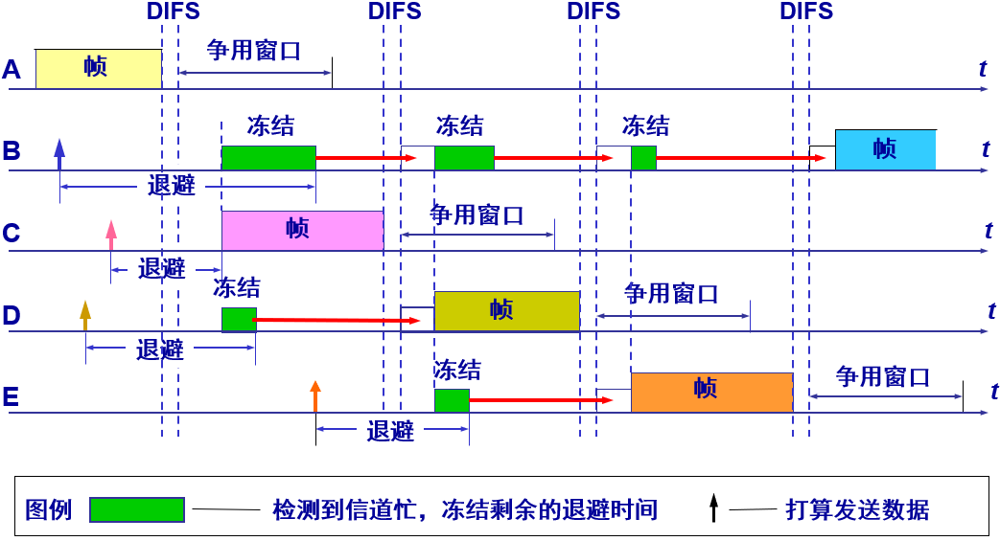

**二进制指数退避算法** 

第 i 次退避就在 22 + i 个时隙中随机地选择一个，即：第 i 次退避是在时隙 {0, 1, …, 22+i – 1} 中随机地选择一个。 

第 1 次退避是在 8 个时隙（而不是 2 个）中随机选择一个。

第 2 次退避是在 16 个时隙（而不是 4 个）中随机选择一个。 

当时隙编号达到 255 时（这对应于第 6 次退避）就不再增加了。

这里决定退避时间的变量 i 称为退避变量。

**退避计时器 (backoff timer)**

站点每经历一个时隙的时间就检测一次信道。

这可能发生两种情况：

- 若检测到信道空闲，退避计时器就继续倒计时。
- 若检测到信道忙，就冻结退避计时器的剩余时间，重新等待信道变为空闲，并再经过时间 DIFS 后，从剩余时间开始继续倒计时。如果退避计时器的时间减小到零时，就开始发送整个数据帧。 

**退避算法的使用情况** 

仅在下面的情况下才不使用退避算法：

- 检测到信道是空闲的，并且这个数据帧是要发送的第一个数据帧。

除此以外的所有情况，都必须使用退避算法：

- 在发送第一个帧之前检测到信道处于忙态。
- 在每一次的重传后。
- 在每一次的成功发送后。  

**CSMA/CA 算法归纳**

(1) 若站点最初有数据要发送（而不是发送不成功再进行重传），且检测到信道空闲，在等待时间 DIFS 后，就发送整个数据帧。

(2) 否则，站点执行 CSMA/CA 协议的退避算法。一旦检测到信道忙，就冻结退避计时器。只要信道空闲，退避计时器就进行倒计时。

(3) 当退避计时器时间减少到零时（这时信道只可能是空闲的），站点就发送整个的帧并等待确认。

(4) 发送站若收到确认，就知道已发送的帧被目的站正确收到了。这时如果要发送第二帧，就要从上面的步骤 (2) 开始，执行 CSMA/CA 协议的退避算法，随机选定一段退避时间。若源站在规定时间内没有收到确认帧 ACK（由重传计时器控制这段时间），就必须重传此帧（再次使用 CSMA/CA 协议争用接入信道），直到收到确认为止，或者经过若干次的重传失败后放弃发送。

#### 2. 对信道进行预约 

为了更好地解决隐蔽站带来的碰撞问题，802.11 允许要发送数据的站对信道进行预约。

使用 RTS 帧和 CTS 帧会使整个网络的通信效率有所下降。但与数据帧相比，开销不算大。

相反，若不使用这种控制帧，则一旦发生碰撞而导致数据帧重发，则浪费的时间就更多。

虽然如此，协议还是设有三种情况供用户选择：

- (1) 使用 RTS 帧和 CTS 帧；
- (2) 只有当数据帧的长度超过某一数值时才使用 RTS 帧和 CTS 帧（显然，当数据帧本身就很短时，再使用 RTS 帧和 CTS 帧只能增加开销）；
- (3) 不使用 RTS 帧和 CTS 帧。

虽然协议经过了精心设计，但碰撞仍然会发生。

**CSMA/CA 协议的基本流程图**

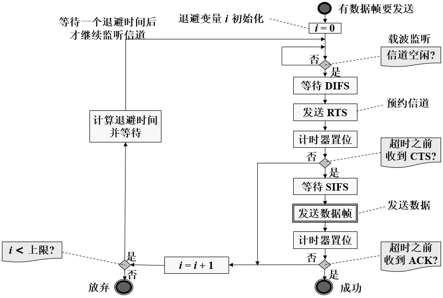

### 9.1.4  802.11 局域网的 MAC 帧

802.11 帧共有三种类型：控制帧、数据帧和管理帧。

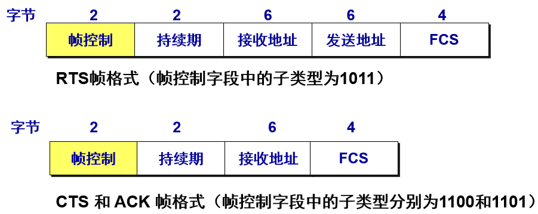

**802.11 数据帧的三大部分** 

MAC 首部，共 30 字节。帧的复杂性都在帧的首部。

帧主体，也就是帧的数据部分，不超过 2312 字节。这个数值比以太网的最大长度长很多。不过 802.11 帧的长度通常都是小于 1500 字节。

帧检验序列 FCS 是尾部，共 4 字节 

#### 1. 关于 802.11 数据帧的地址

802.11 数据帧最特殊的地方就是有四个地址字段。地址 4 用于自组网络。我们在这里只讨论前三种地址。 

| 去往 AP | 来自 AP | 地址 1   | 地址 2  | 地址 3   | 地址 4 |
| ------- | ------- | -------- | ------- | -------- | ------ |
| 0       | 1       | 目的地址 | AP 地址 | 源地址   | ——     |
| 1       | 0       | AP 地址  | 源地址  | 目的地址 | ——     |

站点 A 向 B 发送数据帧，或路由器 R 向 C 发送数据，但数据帧必须经过 AP 转发。

数据报在路由器 R 与移动站 C 之间传送（表中地址都是MAC地址）

| 数据报流向         | 去往AP | 来自AP | 地址1      | 地址2      | 地址3      | 地址4 |
| ------------------ | ------ | ------ | ---------- | ---------- | ---------- | ----- |
| R接口2  >>    AP2  | 1      | 0      | AP2地址    | R接口2地址 | C的地址    | ——    |
| AP2  >>  C         | 0      | 1      | C的地址    | AP2地址    | R接口2地址 | ——    |
| C >>  AP2          | 1      | 0      | AP2地址    | C的地址    | R接口2地址 | ——    |
| AP2 >>  R  接口  2 | 0      | 1      | R接口2地址 | AP2地址    | C的地址    | ——    |

#### 2. 序号控制、持续期和帧控制字段 

序号控制字段占 16 位，其中序号子字段占 12 位，分片子字段占 4 位。

持续期字段占 16 位。

帧控制字段共分为 11 个子字段：

- 协议版本字段现在是  0。
- 类型字段和子类型字段用来区分帧的功能。
- 更多分片字段置为 1 时表明这个帧属于一个帧的多个分片之一。
- 有线等效保密字段 WEP 占 1 位。若 WEP = 1，就表明采用了 WEP 加密算法。      

**分片的发送举例** 

为了提高传输效率，在信道质量较差时，需要把一个较长的帧划分为许多较短的分片。

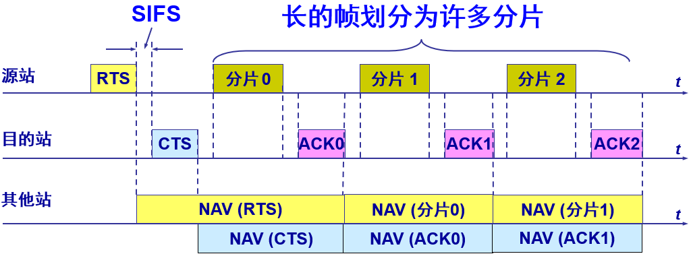

## 9.2  无线个人区域网 WPAN

无线个人区域网 WPAN (Wireless Personal Area Network) 就是在个人工作地方把属于个人使用的电子设备用无线技术连接起来自组网络，不需要使用接入点 AP。

整个网络的范围大约在 10 m左右。

WPAN可以是一个人使用，也可以是若干人共同使用。

无线个人区域网 WPAN 和个人区域网 PAN (Personal Area Network) 并不完全等同，因为 PAN 不一定都是使用无线连接的。   

**WPAN 和 WLAN 并不一样** 

WPAN 是以个人为中心来使用的无线人个区域网，它实际上就是一个低功率、小范围、低速率和低价格的电缆替代技术。

 WLAN 却是同时为许多用户服务的无线局域网，它是一个大功率、中等范围、高速率的局域网。 

**WPAN 标准**

WPAN 的 IEEE 标准由 IEEE 的 802.15 工作组制定，这个标准也是包括 MAC 层和物理层这两层的标准。

WPAN 都工作在 2.4 GHz的 ISM 频段。

顺便指出，欧洲的 ETSI 标准则把无线个人区域网取名为 HiperPAN。

#### 1. 蓝牙系统 (Bluetooth)

最早使用的 WPAN 是 1994 年爱立信公司推出的蓝牙系统，其标准是 IEEE 802.15.1 。

蓝牙的数据率为 720 kbit/s，通信范围在 10 米左右。

蓝牙使用 TDM 方式和扩频跳频 FHSS 技术组成不用基站的皮可网 (piconet)。

**皮可网(piconet)**

Piconet 直译就是“微微网”，表示这种无线网络的覆盖面积非常小。

每一个皮可网有一个主设备 (Master) 和最多7个工作的从设备 (Slave)。

通过共享主设备或从设备，可以把多个皮可网链接起来，形成一个范围更大的扩散网 (scatternet)。

这种主从工作方式的个人区域网实现起来价格就会比较便宜。  

**蓝牙系统中的皮可网和扩散网** 

#### 2. 低速 WPAN 

低速 WPAN 主要用于工业监控组网、办公自动化与控制等领域，其速率是 2 ~ 250 kbit/s。

低速 WPAN 的标准是 IEEE 802.15.4。最近新修订的标准是 IEEE 802.15.4-2006。

低速 WPAN 中最重要的就是 ZigBee。

ZigBee 技术主要用于各种电子设备（固定的、便携的或移动的）之间的无线通信，其主要特点是通信距离短（10 ~ 80 m），传输数据速率低，并且成本低廉。 

**ZigBee 的特点**

功耗非常低

- 在工作时，信号的收发时间很短；而在非工作时，ZigBee 结点处于休眠状态，非常省电。对于某些工作时间和总时间之比小于 1% 的情况，电池的寿命甚至可以超过10 年。

网络容量大

- 一个 ZigBee 的网络最多包括有 255 个结点，其中一个是主设备，其余则是从设备。若是通过网络协调器，整个网络最多可以支持超过 64000 个结点。 

**ZigBee 的标准**

在 IEEE 802.15.4 标准基础上发展而来的。

所有 ZigBee 产品也是 802.15.4 产品。

IEEE 802.15.4 只是定义了 ZigBee 协议栈的最低的两层（物理层和 MAC 层），而上面的两层（网络层和应用层）则是由 ZigBee 联盟定义的。

**ZigBee 的协议栈** 

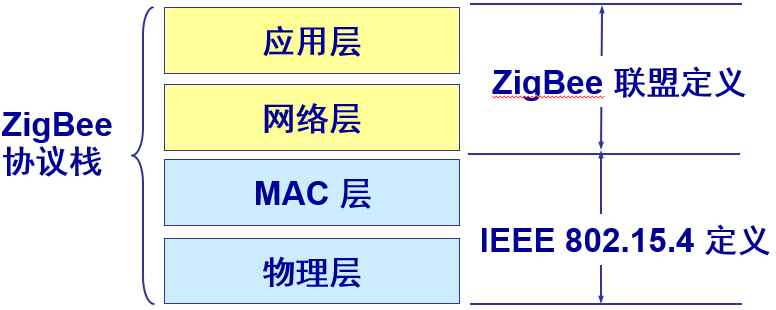

IEEE 802.15.4 物理层使用的三个频段

| 频段            | 数据率     | 信道数 |
| --------------- | ---------- | ------ |
| 2.4 GHz（全球） | 250 kbit/s | 16     |
| 915 MHz（美国） | 40 kbit/s  | 10     |
| 868 MHz（欧洲） | 20 kbit/s  | 1      |

在 MAC 层，主要沿用 802.11 无线局域网标准的 CSMA/CA 协议。

在网络层，ZigBee 可采用星形和网状拓扑，或两者的组合。

**ZigBee 的组网方式**

一个 ZigBee 网络最多可以有 255 个结点。

ZigBee 的结点按功能的强弱可划分为两大类：

- 全功能设备 FFD (Full-Function Device) 

  - 具备控制器（Controller）的功能，能够提供数据交换。

  - 是 ZigBee 网络中的路由器。

- 精简功能设备 RFD (Reduced-Function Device) 
  - 是 ZigBee 网络中数量最多的端设备。
  - 电路简单，存储容量较小，因而成本较低。
  - RFD 结点只能与处在该星形网中心的 FFD 结点交换数据。

在一个 ZigBee 网络中有一个 FFD 充当该网络的协调器 (coordinator)。

协调器负责维护整个 ZigBee 网络的结点信息，同时还可以与其他 ZigBee 网络的协调器交换数据。

通过各网络协调器的相互通信，可以得到覆盖更大范围、超过 65000 个结点的 ZigBee 网络。

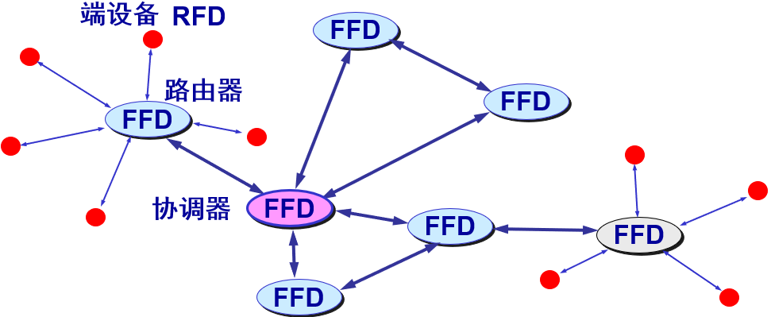

有一个全功能设备 FFD 充当网络的协调器。

ZigBee 网络中数量最多的端设备是精简功能设备 RFD 结点。 

#### 3. 高速 WPAN

高速 WPAN 用于在便携式多媒体装置之间传送数据，支持11 ~ 55 Mbit/s 的数据率，标准是 802.15.3。

IEEE 802.15.3a 工作组还提出了更高数据率的物理层标准的超高速 WPAN，它使用超宽带 UWB 技术。

UWB 技术工作在 3.1 ~ 10.6 GHz 微波频段，有非常高的信道带宽。超宽带信号的带宽应超过信号中心频率的 25% 以上，或信号的绝对带宽超过 500 MHz。

超宽带技术使用了瞬间高速脉冲，可支持 100 ~ 400 Mbit/s 的数据率，可用于小范围内高速传送图像或 DVD 质量的多媒体视频文件。 

## 9.3  无线城域网 WMAN

2002 年 4 月通过了 IEEE 802.16 无线城域网(Wireless Metropolitan Area Network) 的标准（又称为IEEE无线城域网空中接口标准） 。

欧洲的 ETSI 也制订类似的无线城域网标准 HiperMAN。

WMAN 可提供“最后一英里”的宽带无线接入（固定的、移动的和便携的）。

在许多情况下，无线城域网可用来代替现有的有线宽带接入，因此它有时又称为无线本地环路。   

**WiMAX** 

WiMAX (Worldwide Interoperability for Microwave Access) 常用来表示无线城域网 WMAN，这与Wi-Fi 常用来表示无线局域网 WLAN 相似。

IEEE 的 802.16 工作组是无线城域网标准的制订者，而 WiMAX 论坛则是 802.16 技术的推动者。

WMAN有两个正式标准：

- 802.16d (它的正式名字是 802.16-2004)：固定宽带无线接入空中接口标准（2 ~ 66 GHz频段）。
- 802.16e (802.16 的增强版本)：支持移动性的宽带无线接入空中接口标准（2 ~ 6 GHz频段），向下兼容 802.16-2004。  

**802.16 无线城域网服务范围的示意图** 

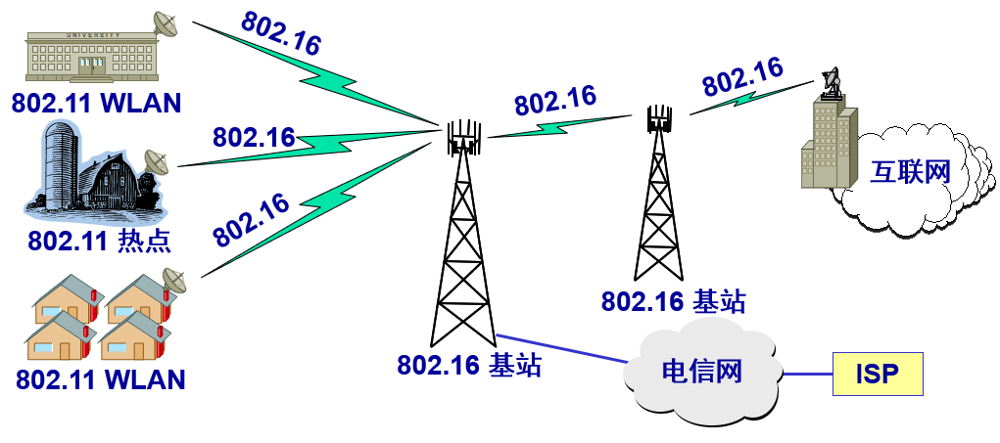

## 9.4  蜂窝移动通信网

### 9.4.1  蜂窝无线通信技术简介

蜂窝移动网络的发展非常迅速，到目前为止，世界上先后已有超过了 30 种不同的标准。

第一代（1G）蜂窝无线通信是为话音通信设计的模拟 FDM 系统。

第二代（2G）蜂窝无线通信提供低速数字通信（短信服务），其代表性体制就是最流行的 GSM 系统。

2.5G 技术是从 2G 向第三代（3G）过渡的衔接性技术，如 GPRS 和 EDGE 等。

第三代（3G） 移动通信和计算机网络的关系非常密切，它使用 IP 的体系结构和混合的交换机制（电路交换和分组交换），能够提供移动宽带多媒体业务（话音、数据、视频等，可收发电子邮件，浏览网页，进行视频会议等），如 CDMA2000，WCDMA 和 TD-SCDMA。

从 3G 开始以后的各代蜂窝移动通信都是以传输数据业务为主的通信系统，而且必须兼容 2G 的功能（即能够通电话和发送短信），这就是所谓的向后兼容。  

第四代（4G）正式名称是 IMT-Advanced (International Mobile Telecommunications-Advanced)，意思是高级国际移动通信。

4G的一个重要技术指标就是要实现更高的数据率。目标峰值数据率是：固定的和低速移动通信时应达到1 Gbit/s，在高速移动通信时（如在火车。汽车上）应达到100 Mbit/s。

4G 现有两个国际标准：

- LTE (Long-Term Evolution)： 
  - 又分为时分双工 TD-LTE 和 频分双工 FDD-LTE 两种。
  - 把带宽增加到 20 MHz，采用了高阶调制 64QAM 和 MIMO 技术。

- LTE-A (LTE-Advanced)：
  - LTE 的升级版，俗称为 3.9G。
  - 带宽高达 100 MHz。

**GSM 蜂窝通信系统的重要组成构件** 

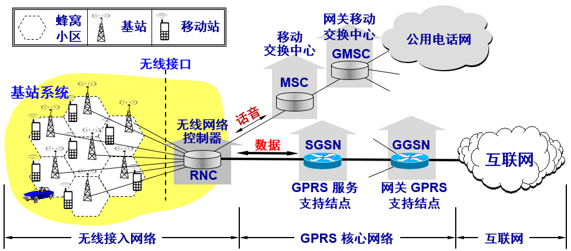

用一个个相互拼接的六角形的小区就可以组成很大的蜂窝状的无线通信系统。每个基站的发射功率既要能够覆盖本小区，也不能太大以致干扰了邻近小区的通信。

### 9.4.2  移动 IP

移动 IP (Mobile IP)又称为移动 IP 协议，是由IETF 开发的一种技术。移动 IP 对现在流行的在移动中上网有着重要的意义。

这种技术允许计算机移动到外地时，仍然保留其原来的 IP 地址。

移动 IP 要解决的问题：使用户的移动性对上层的网络应用是透明的。  

**移动 IP 使用的基本概念** 

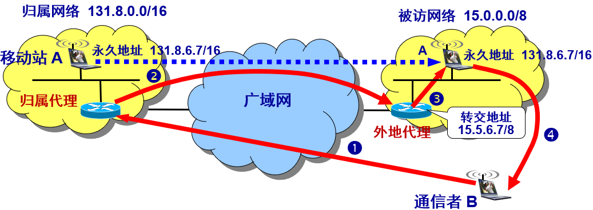

移动站A必须有一个原始地址，即永久地址，或归属地址 (home address)。移动站原始连接到的网络叫做归属网络 (home network)。归属网络中使用的代理叫做归属代理 (home agent) 。

当移动站A移动到另一个地点，接入的网络称为被访网络 (visited network)或外地网络 (foreign network)。被访网络中使用的代理叫做外地代理 (foreign agent)。为移动站A在被访网络中创建的临时地址叫做转交地址 (care-of address)。

**通信者 B 和移动站 A 的四个重要通信步骤**

1、B 发送给 A 的数据报被 A 的归属代理截获了（只有当 A 离开归属网络时，归属代理才能截获发给 A 的数据报）。

2、由于归属代理已经知道了 A 的转交地址（后面要讲到），因此归属代理把 B 发来的数据报进行再封装，新的数据报的目的地址是 A 现在的转交地址。新封装的数据报发送到被访网络的外地代理。这里使用的就是以前讲过的隧道技术或 IP-in-IP。

3、被访网络中的外地代理把收到的封装的数据报进行拆封，取出 B 发送的原始数据报，然后转发给移动站 A。这个数据报的目的地址就是 A 的永久地址。A 收到 B 发送的原始数据报后，也得到了 B 的 IP 地址。

4、 如果现在 A 要向 B 发送数据报，那么情况就比较简单。A 仍然使用自己的永久地址作为数据报的源地址，用 B 的 IP 地址作为数据报的目的地址。这个数据报显然没有必要在通过 A 的归属代理进行转发了。

**网络层应增加的新功能**

(1) 移动站到外地代理的协议。

(2) 外地代理到归属代理的登记协议。

(3) 归属代理数据报封装协议。

(4) 外地代理拆封协议。

**三角形路由选择问题**

间接路由选择：把数据报发往移动站的归属网络，由归属代理完成以后的寻址工作，进而完成数据报转发的方式。

间接路由选择可能会引起数据报转发的低效，文献中称之为三角形路由选择问题 (triangle routing problem)。意思是：本来在 B 和 A 之间可能有一条更有效的路由，但现在要走另外两条路：先要把数据报从 B 发送到 A 的归属代理，然后再转发给漫游到被访网络的 A。

**使用直接路由选择向移动站发送数据报**

让通信者B创建一个通信者代理 (correspondent agent)，让这个通信者代理向归属代理询问到移动站在被访网络的转交地址。然后由通信者代理把数据报用隧道技术发送到被访网络的外地代理，最后再由这个外地代理拆封，把数据报转发给移动站。但这是以增加复杂性为代价的。

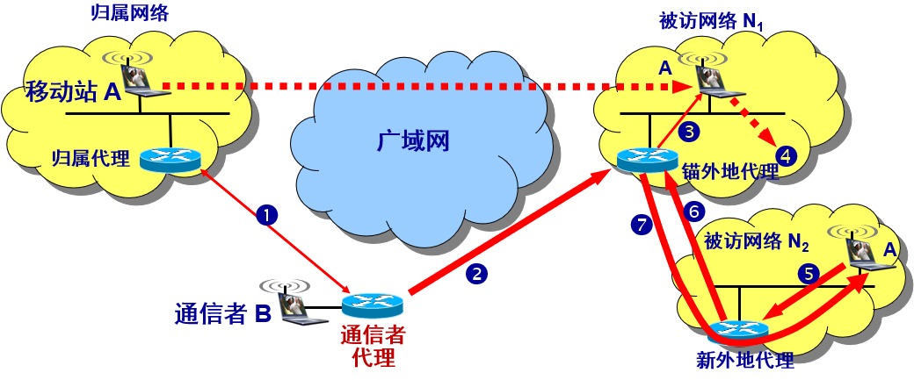

**使用直接路由选择向移动站发送数据报**

1、B 的通信者代理从移动站A的归属代理得到 A 所漫游到的被访网络 N1 的外地代理。我们把移动站首次漫游到的被访网络的外地代理称为锚外地代理 (anchor foreign agent)。

2、 通信者代理把 B 发给 A 的数据报再封装后，发送到 A 的锚外地代理。

3、 锚外地代理把拆封后的数据报发送给 A。

4、 A 移动到另一个被访网络 N2。

5、 A 向被访网络 N2 的新外地代理登记。

6、 新外地代理把 A 的新转交地址告诉锚外地代理。

7、 当锚外地代理收到发给 A 的封装数据报后，就用 A 的新转交地址对数据报进行再封装，然后发送给被访网络 N2 上的新外地代理。在拆封后转发给移动站 A。

同理，如果移动站再漫游到另一个网络，则这个网络的外地代理将仍然要和锚外地代理联系，以便让锚外地代理以后把发给A的数据报转发过来。

### 9.4.3  蜂窝移动通信网中对移动用户的路由选择

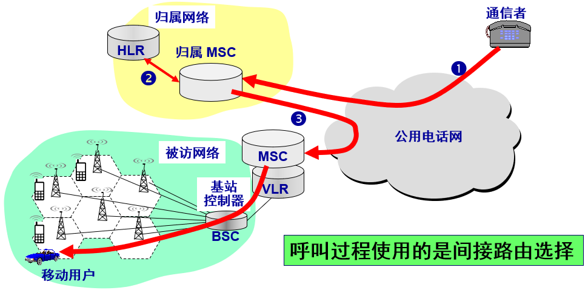

1  找到移动用户的归属网络。

2 归属 MSC 向其 HLR 查询现在被叫移动用户的位置。HLR 向归属 MSC 返回被叫移动用户的移动站漫游号 MSRN。

3  归属 MSC 按照所得到的漫游号码 MSRN 进行呼叫的第二段，把通信者发起的呼叫从归属 MSC 传送到被访网络的 MSC，再传送到该移动用户所漫游到的小区的基站。

### 9.4.4  GSM 中的切换

切换 (handover) 就是移动用户与相关联的基站发生了改变。

移动用户在和一个基站相关联期间，会周期性地测量来自其当前基站及其邻近基站的信标信号强度，并将测量结果以每秒 1 ~ 2 次频率报告给当前基站。根据这些测量数据以及邻近蜂窝的当前负载情况，当前基站决定是否发起切换。

移动站的切换可能仍处在同一个 MSC 的控制下，而只是相关联的基站发生了变化。但在许多情况下，移动站的切换是相关联的 MSC 都改变了。在这种情况下，向移动站的呼叫路由会有很大的变化。 

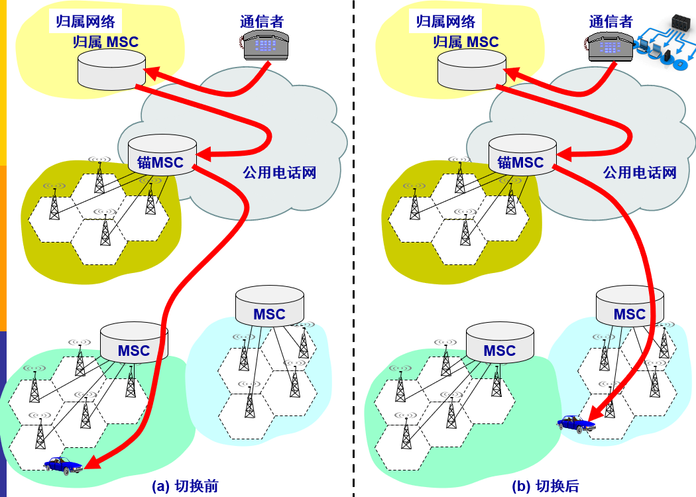

### 9.4.5  无线网络对高层协议的影响

无线网络在移动站漫游时，会经常更换移动用户到无线网络的连接点（即到移动站相关联的基站）。这样，网络的连接就会发生很短时间的中断。

由于移动用户更新相关联的基站需要一定的时间，这就可能造成 TCP 报文段的丢失。只要出现 TCP 报文段频繁丢失，TCP 的拥塞控制就会采取措施，减小其拥塞窗口，从而使 TCP 发送方的报文段发送速率降低。

当无线信道出现严重的比特差错，或由于切换产生了报文段丢失，减小 TCP 发送方的拥塞窗口对改善网络性能并不会有任何好处。

解决方法：

本地恢复。这是指差错在什么地方出现，就在什么地方改正。

让 TCP 发送方知道什么地方使用了无线链路。只有当 TCP 能够确知，是有线网络部分发生了拥塞时，TCP 才采用拥塞控制的策略。

把含有移动用户的端到端 TCP 连接拆成两个互相串接的 TCP 连接。   

## 9.5  两种不同无线上网

前面已经介绍了两种不同的无线上网方法。

但应注意，它们上网所需的费用是很不一样的。

目前蜂窝移动网络的运营商的上网收费都是按照用户所消耗的数据流量来计算的。

我国的宽带入网一般都是根据用户使用的带宽多少，按使用的时间（按月或按年）付费的，因此，使用家庭的无线路由器上网，并不需要再增加任何额外上网的费用。

**几种无线网络的比较**

各种无线网络，可以看出，这些网络各有优缺点，也都有各自最适宜的使用环境。

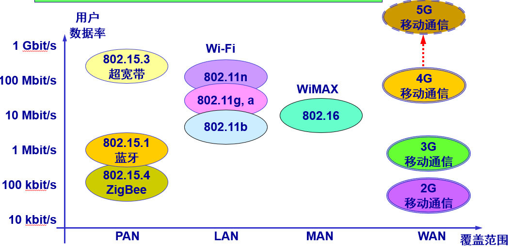

## 